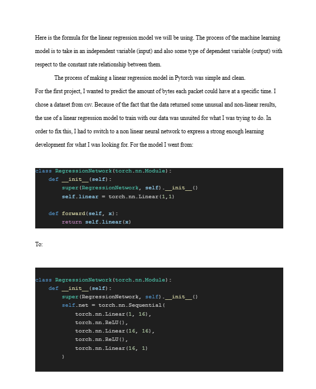

# Purpose

This research paper explores the possibility of artificial sentience by examining various neural network architectures—including Convolutional Neural Networks (CNNs), Graph Neural Networks (GNNs), Recurrent Neural Networks (RNNs), and standard non-linear feedforward networks. By analyzing their structural differences and learning behaviors, the paper investigates how complexity, memory, and pattern recognition contribute to the theoretical foundation for machine awareness. This research paper is not yet complete therefore will not be released. Sample pages are given below. 

## Progress of research paper 
9/18 pages completed (50%)

# Example of pages

## Page 1 of research paper

## Page 3 of research paper

## Page 5 of research paper 

## Network Traffic Prediction Project 

First project connected to the paper: 
https://github.com/Justinfinn2891/Network-Traffic-Predictions/tree/main

## Neural Network from scratch

Scratch Neural Network project connected to the paper: 
https://github.com/Justinfinn2891/Scratch-Neural-Network

## Oracle GPU (Recurrent LSTM Neural Network) 

OracleGPU project connected to the paper: 
https://github.com/Justinfinn2891/OracleGPU-Graphics-Card-Price-Predictor
